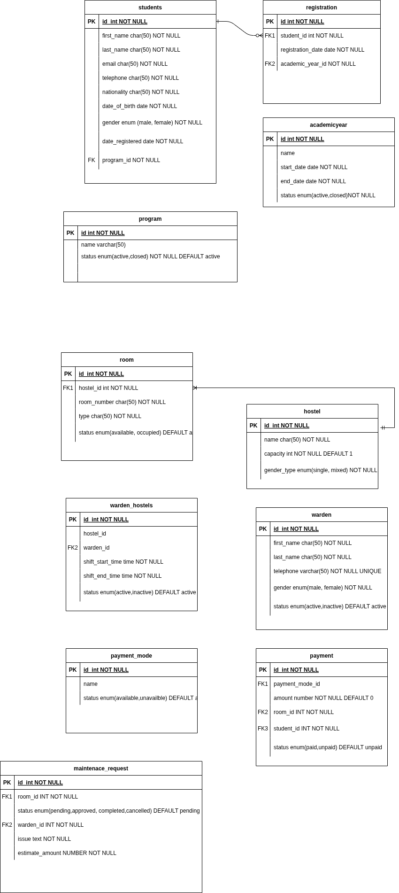

# Hostel Management System Database

## Overview
This project implements a relational database for a Hostel Management System designed for educational institutions. The system manages student accommodations, room assignments, payments, and maintenance requests for campus hostels.

## Database Schema



The database consists of the following main entities:

### Academic Program Management
- **Program**: Stores academic programs offered by the institution
- **Students**: Contains student personal information and program enrollment
- **Academic Year**: Defines academic periods
- **Registration**: Tracks student registrations for academic years

### Hostel Management
- **Hostel**: Stores information about different hostels, including capacity and gender type
- **Room**: Contains details about individual rooms within hostels
- **Warden**: Manages staff responsible for hostel supervision
- **Warden_Hostels**: Maps wardens to the hostels they supervise, including shift times

### Financial Management
- **Payment_Mode**: Defines available payment methods
- **Payment**: Records student payments for room accommodations

### Maintenance
- **Maintenance_Request**: Tracks maintenance issues, approvals, and completion status

## Key Features

1. **Student Management**: Track student information, program enrollment, and academic registration
2. **Room Allocation**: Manage hostel rooms and their occupancy status
3. **Staff Management**: Assign wardens to hostels with specific shift schedules
4. **Payment Processing**: Record and track accommodation payments
5. **Maintenance Tracking**: Log and process maintenance requests for rooms
6. **Automated Room Status Management**: Triggers to update room status when payments are made
7. **Double Allocation Prevention**: System safeguards to prevent multiple allocations of the same room
8. **Revenue Reporting**: Monthly revenue tracking per hostel
9. **Maintenance Analysis**: Identify rooms with recurring maintenance issues

## Database Constraints

The database implements several constraints to maintain data integrity:

- **Foreign Key Constraints**: Ensure referential integrity between related tables
- **Check Constraints**: Validate data values (e.g., gender types, status values)
- **Unique Constraints**: Prevent duplicate entries (e.g., unique email addresses, program names)
- **Default Values**: Provide sensible defaults for status fields and timestamps
- **Cascading Deletes**: Automatic cleanup of related records (e.g., maintenance requests when rooms are deleted)

## Triggers and Functions

The system implements several triggers and functions to automate processes:

1. **mark_room_occupied_on_payment()**: Automatically updates room status to 'occupied' when payment is confirmed
2. **prevent_double_allocation()**: Prevents multiple allocations of the same room

## Views

The database includes the following views for reporting:

- **hostel_revenue_monthly**: Summarizes revenue by hostel and month

## Example Queries

1. **Room Occupancy with Payment Status**:
   ```sql
   -- Retrieve list of occupied rooms with payment status
   WITH last_payment AS (
     SELECT DISTINCT ON (p.room_id)
            p.room_id, p.status AS payment_status, p.amount, p.paid_at, p.student_id
     FROM payment p
     ORDER BY p.room_id, COALESCE(p.paid_at, NOW()) DESC, p.id DESC
   )
   SELECT
     r.id AS room_id,
     r.room_number,
     h.name AS hostel_name,
     lp.payment_status,
     lp.amount,
     lp.paid_at,
     s.first_name || ' ' || s.last_name AS last_paying_student
   FROM room r
   JOIN hostel h ON h.id = r.hostel_id
   LEFT JOIN last_payment lp ON lp.room_id = r.id
   LEFT JOIN students s ON s.id = lp.student_id
   WHERE r.status = 'occupied'
   ORDER BY h.name, r.room_number;
   ```

2. **Rooms with Repeated Maintenance Issues**:
   ```sql
   SELECT
     r.id AS room_id,
     r.room_number,
     h.name AS hostel_name,
     COUNT(*) AS request_count
   FROM maintenance_request mr
   JOIN room r ON r.id = mr.room_id
   JOIN hostel h ON h.id = r.hostel_id
   GROUP BY r.id, r.room_number, h.name
   HAVING COUNT(*) > 1
   ORDER BY request_count DESC, hostel_name, room_number;
   ```

## Sample Data

The system includes sample data for testing:
- 3 hostels: Gikondo branch, Nyarugenge branch, and Remera branch
- 10 students with complete profiles
- 5 rooms across different hostels
- 3 payment modes: Cash, Mobile Money, and Card

## Indexes

Strategic indexes have been created to optimize query performance on frequently accessed columns and foreign keys.

## Usage

To initialize the database:

1. Run the `structure.sql` script to create the database schema
2. Run the `answers_commands.sql` script to add triggers, functions, views, and sample data
3. Use SQL queries to interact with the database

## Technical Details

- Database System: PostgreSQL
- Schema Version: 1.0
- Last Updated: October 2025
